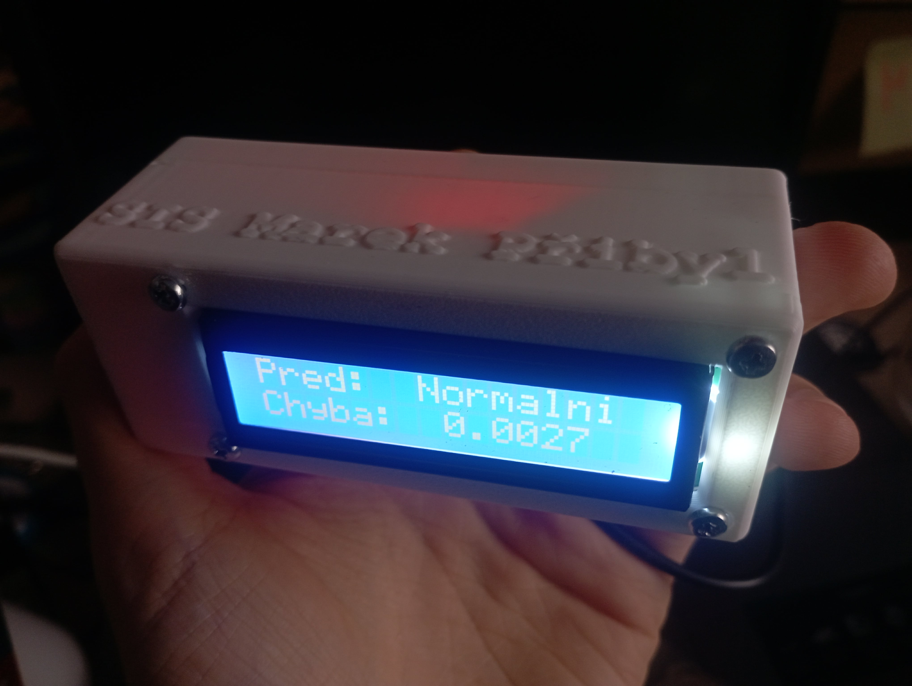

# Semestrální práce do předmětu principy inteligentních systémů

Tento repozitář obsahuje semestrální práci do předmětu Principy inteligentních systémů na Vysokém učení technickém v Brně. Cílem projektu je vytvořit systém pro sběr, zpracování a analýzu síťových logů pomocí různých modulů a technik umělé inteligence. 

Myšlenka je vytvořit robustní a efektivní nástroj, který umožní monitorování a analýzu síťového provozu v reálném čase, s možností rozšíření o další funkce a moduly. 

## Cíle projektu
- funkční program pro sběr a zpracování síťových logů,
- modularita - systém bude navržen tak, aby umožňoval snadné přidávání nových modulů a funkcí v budoucnu
- efektivita - budu se snažit o optimalizaci výkonu a minimalizaci zátěže systému, což je klíčové pro reálné nasazení. Má představa je, že to bude implementováno na nějakém mikroprocesoru nebo embedded zařízení, tedy se silně omezenými zdroji
- postupné učení se z nových dat - za posledních deset let se chtě nechtě svět internetu proměnil k nepoznání, a tak by bylo vhodné, aby systém dokázal adaptovat své modely na nové vzory a trendy v síťovém provozu
- uživatelské rozhraní - jednoduché a intuitivní uživatelské rozhraní pro snadnou konfiguraci a správu systému

## Struktura repozitáře
- `receiver/` - modul pro příjem a zpracování síťových logů
  - `module1/` - základní modul pro příjem logů
  - `module2/` - modul pro předzpracování dat
  - `module3/` - modul pro analýzu nadcházejících dat pomocí jednoduchých algoritmů
  - `module4/` - modul pro vizualizaci dat
- `sender/` - program pro odesílání síťových logů
- `data/` - data, se kterými bylo pracováno
- `bin/` - složka s .exe soubory připravenými ke spuštění
- `tools/` - složka s užitečnými nástroji, aktuálně se tam nachází nástroj na generování dokumentace

## Využití neuronové sítě v praxi
Síť se průběžně učí z nových dat a je navržena pro zařízení s omezenými zdroji. Implementoval jsem ji jako svou knihovnu pro ESP8266. Na základě routerových logů dokáže předpovídat blížící se problémy s připojením s dostatečným předstihem.
Níže je fotografie použitého zařízení:

